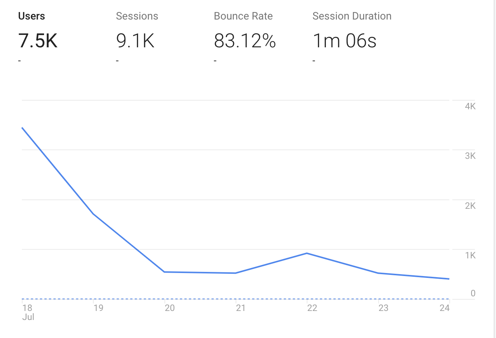

Snapboard ended up being pretty successful - but the road to getting there was hard. Those following along on my [daily updates](/snapboard) will know it didn’t take a week - but ended up taking 29 days! Although there were lots of positives, there were also lots of lessons learned, and so here is the bittersweet story of Snapboard's build and launch.


## The good

Although I spent way too long on Snapboard, I’m amazed by how much I achieved in 29 days. And that’s down to one thing alone - I’ve started to use the right tools for the job!

Snapboard’s infrastructure is incredibly simple:

* **Deployment** - 100% serverless using AWS Lambda and Google Cloud Functions
* **Scheduling** - using Google Cloud Functions with in-built CRON and pub/sub integration
* **DB** - Firebase is the only DB (I had a thought to use Elasticsearch, but thankfully realised that would over-complicate things, and found a workaround!)
* **Frontend** - React and Emotion-UI on the frontend

There is no way I could have built Snapboard without using these faster than ever development tools! 

I also, thankfully, decided in the last week to make sure there were enough pre-built cards, to make it useable for people who don’t want to create their own. I thought this would be useful to help people understand the product, and provide some initial value. But with only 49 custom cards being created, it’s clear that most people just want to use pre-existing cards. Maybe the fact that they know they can edit them in the future, encouraged them to signup and will still prove to be useful - but for now the pre-built cards are key to retaining users!

The launch itself went better than expected. I’d seen other similar products not do so well, so I was quite nervous. And again, Product Hunt did not help the nerves by refusing to promote the product in the “Popular” section (the only section people look at), until 10.30am. That meant 1hr 30 mins of stressful pacing up and down, and working hard to get the message out.

As soon as it got onto the “Popular” page, I stopped promoting the product. After all, I’m trying to gauge whether people like the product, not whether I have a big enough following to force it through.

So here are the stats from the launch week:

* 7.5k unique visits
* 1.2k account signups
* 49 custom cards created




## The bad (and lessons learnt)

The fundamental mistake I made was losing sight of why I started one product a week in the first place. And that was… to validate whether there’s a market for my product idea - and *not* to try and build a viable business in a single week.

That perhaps small shift in perspective, makes a huge difference to - which ideas you choose, how you approach the problem, and how you determine success. And it’s these things that ended up making Snapboard last for 29 days, instead of a week!

When I first started one product a week and shared it across communities (Reddit, IndieHackers, etc) - I had some valid feedback questioning the premise:

```
 * How can you launch anything of value in a week?
 * What happens if more features are required to make it valuable enough to pay charge for?
 * Why are you not validating the idea first?
```

The key here, is that most of these questions assume I’m using 1 Product a Week to launch a business. I’m not (at least going forward I’m not!). I’m using it to validate an idea - which may or may not end up becoming a business.

Traditionally, the prevailing wisdom has been to validate ideas by speaking to users, perhaps building a landing page and then building a prototype with early users.

That sounds good in theory, but it can be easier said than done - and it can end up being just another barrier between you and your idea.

Speaking to users can lead to very misleading results. If you’re not very careful how you ask your questions - you won’t get accurate feedback. People are overly optimistic about the future and so can imagine a world where they use your product, but in reality they never will (we might also imagine a world where we’ll go the gym tomorrow, but we often won’t!)

On top of that, if you’re too broad with your demographic the results can be very confusing (as they all want something different), whilst if you go to specific you can end up missing the right market with a false negative (e.g. this group didn’t like it, but another group might).

You can also build a landing page, but free from the shackles of actually having to build something immediately, you can overkill the idea, adding every feature you can think of to sell it. You may get positive feedback (of course who wouldn’t want an app that does everything), but it would take 10 years to build - and would be extremely difficult to use.

Instead, I plan to create products around problems that I experience myself. That means there’s at least one person in this world who cares passionately about the problem, knows the problem inside out and has searched for an alternative and come up empty handed. And as that’s me, I don’t have to keep drilling other people for the information.

I can then validate it by building an actual product in a week to see if others find it useful. If they don’t - no problem, I only spent a week on it and I can cross that idea off my list forever. That’s worth a week in itself. Plus, it was a problem I faced - so I’ve made my life slightly better in the process.

But some things just need more time to make them work? Maybe - but the reason most people don’t use products, is not because they don’t have enough features (actually usually the reverse is true, more features ends up in a confusing mess). They don’t use products because it doesn’t solve the one burning problem they have - or it’s not immediately obvious that it does (and people only give you a few seconds). Features are for retaining customers, not for attaining them.

So if I’ve not found a burning problem with this idea - I need to move on. 

If it does get some traction, I now have a captive audience of users - who are more likely to be in a common demographic and who I can now talk to. And they’re much more likely to speak to me, given I’ve already built something useful for them (and so I have a track record of solving their problems).


## A new criteria
So going forward, I’m going to be keeping to the following criteria:

1. I have the problem myself and I’ve searched hard for a solution (and not found one)
2. I’ve found a _single entrypoint feature_ which solves the problem in a simple, obvious and fast way
3. It does not rely on extensive upkeep, community contributions, or a large amount amount of pre-existing content (e.g. templates, examples, etc)
4. I’m confident I can complete it in under a week, without it being a ridiculous technical challenge - this is not an exercise in technical mastery!

And importantly, I will be treating this as an exercise of validation, which I may or may not make into a viable business at a later date.

Snapboard met criteria 1 (it is definitely a problem I have), partially met the criteria 2 (it could have been simple, obvious and fast), and completely failed criteria 3 and 4. I was also too focussed on making it into a viable business from day 1. Frustratingly, I’ve since found other, more simple ways to solve the same problem - so it was possible.

Hopefully, keeping this as a guide will help me avoid the same mistakes with future products! Please do challenge me on Twitter or e-mail (calum@1productaweek.com) if you feel like I’m flying too far from these goals.


Hope that's useful!
