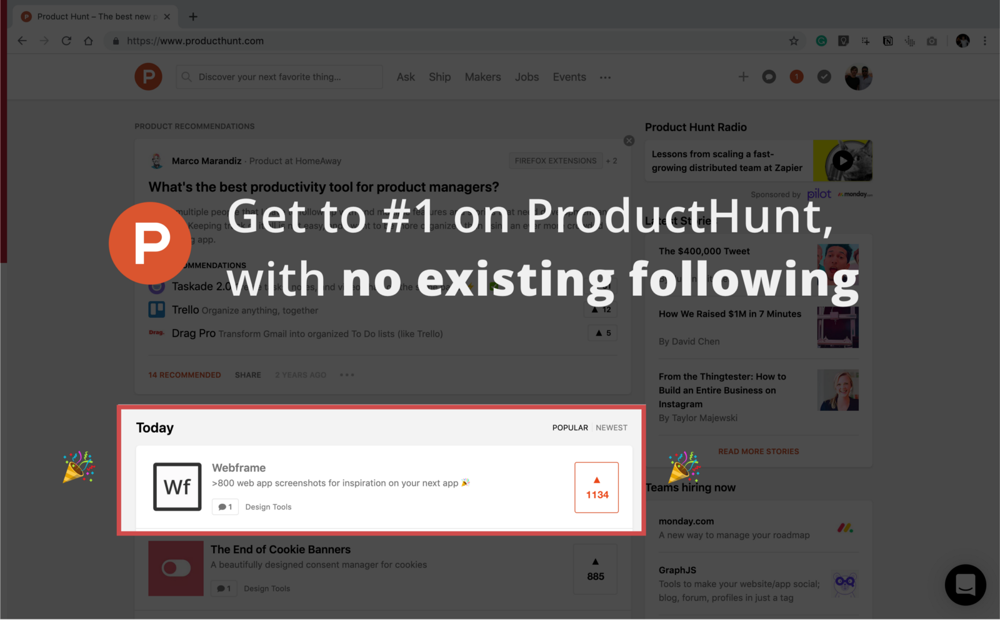
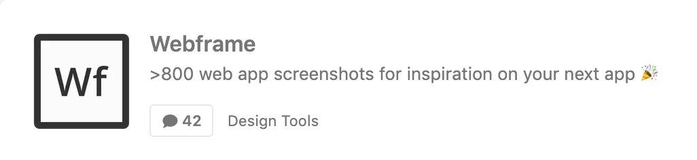
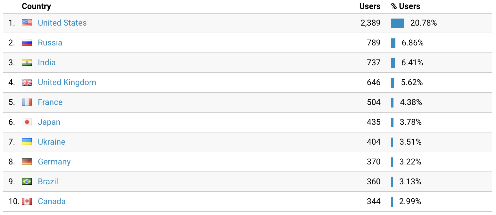
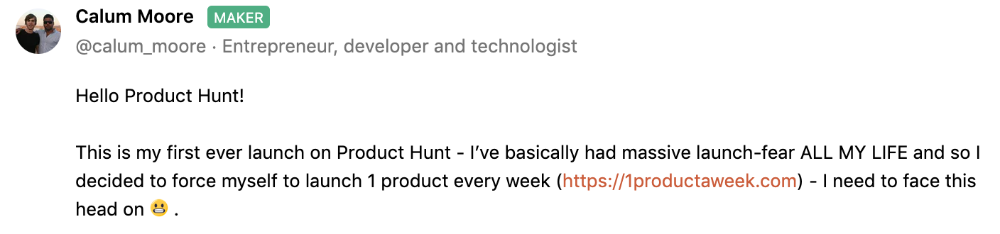
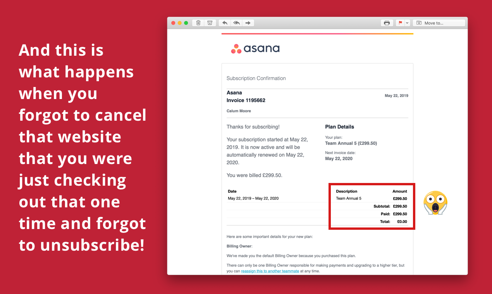
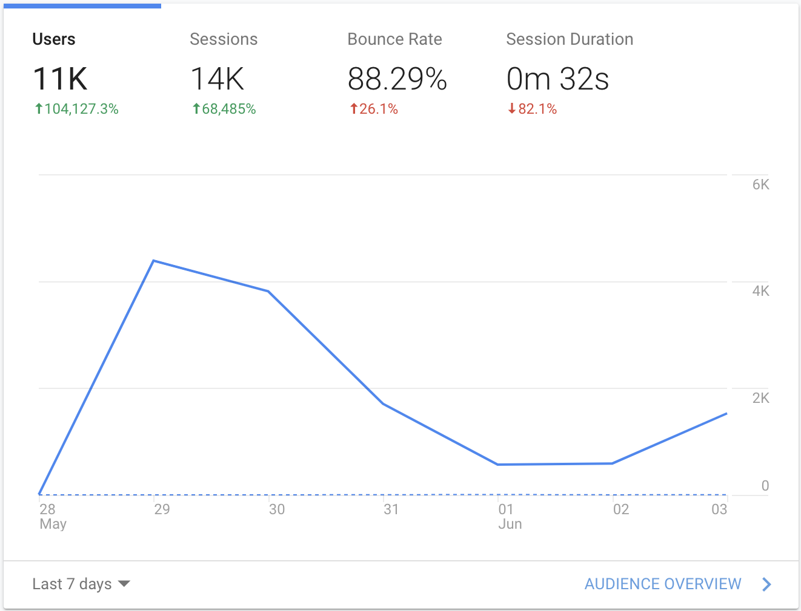

This is the story of how I launched [Webframe](https://webframe.xyz/) and got it to [#1 on Product Hunt](https://www.producthunt.com/posts/webframe) for the day and week (with 1200+ upvotes), with absolutely no existing following — and how you can too 🎉.

There’s a dangerous and unhelpful idea going around that you need a massive following to do well on ProductHunt. You don’t. If nothing else, I’m proof of that.

At the time I launched  [Webframe on Product Hunt](https://www.producthunt.com/posts/webframe) I had:

* ~200 e-mail addresses from an old project
* ~40 followers on Twitter ( [@calummoore](http://twitter.com/calummoore) )
* 3 kudos points on Hacker News
* Never posted anything on Reddit
* 0 existing users on the product

A lot of platforms require you to have a *following*, *kudos* or whatever else they call it in order to get ahead — but not Product Hunt. It’s one of the few platforms willing to surface content on the merit of the actual content — in fact it seems their algorithm actively encourages it.

I’m not saying that having a following is bad — far from it — it definitely helps to have a following or existing audience! But it’s not entirely necessary and there are still ways to succeed if you don’t.

Disclaimer: this guide does not guarantee your product will hit the top of Product Hunt, but it gives you the tools you need to give your product launch its fair chance. I’d also recommend checking out the more generic [Product Hunt launch guide](https://blog.producthunt.com/how-to-launch-on-product-hunt-7c1843e06399) .


### The Product

Because you don’t have a following or a set of existing users, you won’t be referring much traffic directly to your own Product Hunt product page, and so almost all of your upvotes will come from existing Product Hunt users hitting the homepage.

And those existing users will only click into your product if the 160 character tagline is compelling. That’s pretty much the only chance you have to convince people to dig further and upvote.



So it’s absolutely vital that you launch something with a simple value proposition and a fairly broad appeal. Something where it is immediately obvious — what your product does and why it’s valuable to the user.

Here’s a good example.

👍🏽 “A free no-code tool for extracting data from webpages”

From the above, I can easily see what this product does and why it might be useful to me.

Here’s a bad example:

👎🏽 “The best project management tool for remote workers in the US”

A project management tool might be valuable to me, but a lot of that value will depend on how you’ve built the product — which isn’t easy or quick for me to determine. I’m also already using a project management tool so you’re going to have to convince me that not only is your product better, but so much better that it’s worth the pain of switching (so ~10x better). That’s going to be hard to get across in 160 characters. And so, even if the product is super valuable, I’m never going to try it to find out.

The other problem with this example is the size of your product’s target market. If you’re launching a high niche product, you’re already massively limiting the number of people that could find it interesting and valuable — which means fewer upvotes → which means you’re lower down the daily list → which means, even if your target customer visits Product Hunt and *would* have been sold by your tagline, they’re not going to see it because you’re way too far down the list. So for a Product Hunt launch *specifically*, niching is not very helpful.

Finally, if you only support the US (or any other specific country), then you're unlikely to get many upvotes before the US wakes up (as your product won't be useful to anyone else). Early upvotes are so important because they "keep you in the game" - if at any point you drop to the bottom of the daily list, no one will find you no matter how good your product is (and there's no way to fix that without an audience)! For the [Webframe](https://webframe.xyz/) launch, although the US was the largest percentage of users, 7/10 top countries come from Asia/Europe.



So what’s the answer if your product’s value is not immediately obvious OR the target market is small?

***You should launch something else.***

Let me be clear — I’m not saying you should abandon your current product!

Instead, launch something else *first* — a mini-product, tool or resource that’s useful to a fairly large group (that includes your target market), and where the value is more obvious.

This will help you to:

  1. Build an audience with the right type of users (even if it’s broad, it will at least include your target audience)
  2. Direct traffic from your mini-product to your main product
  3. Improve your chances of succeeding in a future launch of your main product (as you’ll now have an audience of relevant people who want to thank you for the value you’ve given them — and they already know about Product Hunt)
  4. Worry less about the launch, as you’ve only spent a week on the product. You can always have another go next week — this isn’t your main product so all is NOT lost!

This is exactly the approach we're taking with [1productaweek.com](https://1productaweek.com/).


#### Tips for mini-products

Here are some quick tips for mini-products:

* Don’t spend more than a week on it - see how we do that at [1productaweek.com](https://1productaweek.com/) 
* Don't make it country specific
* Keep the appeal reasonably broad (don't go too niche)
* Make it new and interesting
* Make it fun (if possible)
* Make it do one thing really well
* Make it free (or at least freemium)
* Check out ProductHunt’s previous top launches to get ideas on what seems to work — e.g. directories, simple tools, and guides seem to work well!


### Before your launch

#### Join communities relevant to your product
You should do this as soon as you can, but even the day before is better than never. Only join communities that are relevant to the product your launching or your target customer. By communities, I mean Slack groups, forums, sub-Reddits, etc. Any place your target customers hang out online.

Once you join, actively participate in them as much as you can without promoting ANY of your content — e.g. blogs, twitter, etc. It’s important at this stage just to be part of the community. The only exception to this is the next step below.

#### Get feedback
Ask the communities you join for feedback on the product that will be launching. The great thing about asking for feedback is that it allows you to improve your product, whilst also getting people engaged and bought into your idea.
To get the most out of this, try to implement as many of the changes they suggest as possible (assuming they fit with the vision for your product), and then let them know when it’s done. Seeing their feedback come to life will make them an extra advocate for you when you come to launch.

#### Build a plan and prep materials
It doesn’t need to be overly complex. Just a list of activities and the time you will perform them. This helps make sure you won’t forget anything and have all the resources you need ahead of time. The launch day is often quite stressful so anything that can be prepped beforehand should be.

Before the launch you should have:

* A template for the e-mail you will send
* A list of people you will e-mail
* A template for the message you will post to communities
* A list of communities you will promote your launch in
* Completed the Product Hunt launch submission and scheduled it to launch automatically at 00:00am.

#### Double check the key flows
Check all of the critical flows the day before your launch, which will give you time to fix anything that comes up. Once you’ve done the final check, don’t make any changes to your code.

#### Make it fun and personal
This can be hard to get right, but anything that makes your launch more fun or personal will help. The most important thing here is to be authentic — don’t try to be something you’re not, people will most likely see straight through it.

If this is your first product, then share that. If you have a personal connection or a funny story related to the problem, share that. Think about anything that made shocked your or made you laugh during the building of the product.

Here I shared something personal:


Here I shared something surprising:



### Launch day

It’s launch day — exciting times! Here’s what you need to do!

#### Launch your product at 00:00am (PST) 
This is the best time to launch if you don’t have an existing audience (to be honest, I would argue this is always the best time to launch regardless).

You need to take full advantage of every single visitor that comes to ProductHunt on your launch day — and so that means starting when the daily clock resets at 00:00am PST. Just 1 hour later by 1:00am (PST) the top 5 products will have around 50 upvotes. Most people only check the top 5 products, and if you’re not there at that point, then you won’t be seen for the rest of the day.
You should schedule your launch to automatically launch at 00:00am (PST) — but make sure you’re awake at that time — as you’ll need to start promoting your product from the very beginning.

#### Get ~10 upvotes in the first 20 minutes
You must be in the top five in the first 20 minutes of the day (which starts 00:00am PST). To do that, you’ll need to get ~10 upvotes in the first 20 minutes.

I would recommend reaching out to friends before the launch and making it clear that you need them to check out the product between 00:00 and 00:10 (PST). It’s only useful to you if they upvote you in this time period. Depending on your own timezone, this may be a bit of a challenge — but it is 100% essential.

Why does it matter so much? Because you don’t have an audience, the only way to get upvotes is from existing visitors to the Product Hunt homepage. And most visitors only look at the top ~5 products. So if you’re not there at the start, you won’t ever get there.

#### Send an e-mail to everyone you know
I know you don’t have a following, but you do probably know some people. Previous colleagues, wider friends, people you met at that meet up a while back — it all helps! I would send the e-mail at around 00:30am (PST), as you will already have a good number of upvotes from the people you pre-prepped (in the step above).

Here are some tips for your e-mail

* Address your contact by name
* Give them a reference of how they know you
* Tell them about the product
* Provide a clear link to Product Hunt (it should be the ONLY link)
* Offer them something personally valuable — below I offer to add them to the site

```
Hi Sarah

I’m Calum — we met a while back at xyz tech event! 🤩

I’ve just launched a new product Webframe on Product Hunt — a website that helps you discover beautiful web app designs from over 1,000 screenshots.

Please check us out on Product Hunt (and upvote only if you think it is worthy 🙏) —  [https://www.producthunt.com/posts/webframe](https://www.producthunt.com/posts/webframe) 

If you’d like to get featured on our site — then hit reply and let me know! I’ll do my best to add you today while traffic is high! 📈

All the best!
Calum
```


#### Send a message in your communities
⚠ Please do not be spammy. That’s more likely to hurt your chances more than help!

Send a message in the appropriate channel for each community that is relevant to your product. Be friendly and personable. Don’t post to more than one channel. Always respect the rules of the community.

Don’t post in communities where your product is not relevant — you might need these communities in the future and posting irrelevant content will ruin your future credibility (and will not provide any benefit as people will not find it valuable)!

#### Answer all comments
People like to see that you are responsive to their feedback. It’s really easy to do and makes people feel part of the process, and therefore more likely to share with their network.

Plus, having a higher number of comments also encourages more people to check out your product.

#### Don’t worry
Don’t worry too much if it doesn’t go to plan — especially if you’ve decided to launch a mini-product first! You’ve probably learned loads and can have another go!


### Results

What can you expect if you launch on Product Hunt and hit #1? The numbers speak for themselves - 11k unique visits to your site!




### TL;DR
* The top five products get most of the traffic from Product Hunt, so getting to the top is very important
* You may need to launch a different but related mini-product first (instead of your main product)— particularly if the value proposition is hard to convey OR the target market is too small
* Join communities relevant to your product’s target market to get feedback and promote your launch
* Keep things fun and personal — everyone loves personality or something that’s funny
* Launch at 00:00 PST time and make sure you get ~10 upvotes in the first 20 mins
* Check out the official ProductHunt launch guide —  [https://blog.producthunt.com/how-to-launch-on-product-hunt-7c1843e06399](https://blog.producthunt.com/how-to-launch-on-product-hunt-7c1843e06399) 

