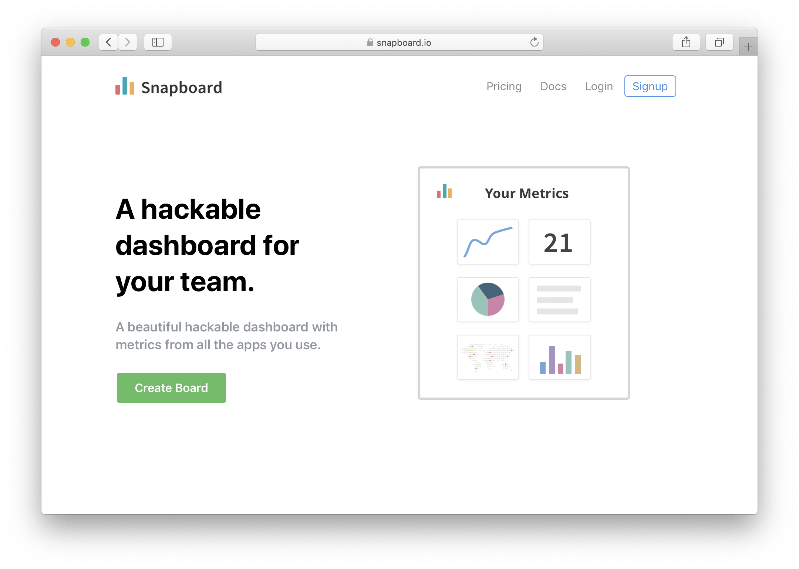

## Plan

#### Problem

Existing dashboard and reporting tools are overly expensive, difficult to setup / use and no-one really ever checks them (possibly because they're hard to share/find)!? On top of that, everyone wants a different a slightly different view, and if your reporting tool doesn't offer it, then your useless to them.


#### User

Teams in a start-up. And entrepreneurs with multiple different products to track.


#### Marketing (after PH launch)

  * Viral - Sharing will be built into the product - allow people to share their reports AND embed charts in their website OR share a particular chart
  * Encourage bloggers / entrepreneurs to share their charts
  * Marketplace for charts - people can create their own sources and charts


#### Pricing / Revenue

 * Free if your chart / dashboard is public

 * Paid for:
   * Private reports
   * Premium integrations
   * Private integrations
   * Frequency of update - 1 min, 1 hr, 1 day


#### Competition

Number only dashboards:

 * [Sunrise KPI](https://sunrisekpi.com) - limited free tier, limited integrations, no charts - only numbers
 * [Dashful](https://dashful.co) - dashboard with numbers only - fairly limited free tier


More complete dashbards (BI tools):

 * [Databox](https://databox.com/pricing) - 3 dashboards and 3 sources for free - slightly longer to create the dashboards - personally I don't like the style
 * [Grow](https://www.grow.com/) - Enterprise only - you have to request pricing!
 * [Klipfolio](https://www.klipfolio.com/) - hard to setup - not an nice UI interface
 * [Mode](https://mode.com/) - Enterprise onl - very expensive!
 * [Google Data Studio](https://datastudio.google.com) - A good tool, if over complicated and difficult to setup


#### Risks / Assumptions

 * There is a lot of competition in this market!
 * The development could be challenging - as integrating lots of apps is hard


#### MVP / Keep it simple

 * Limited the number of graph types - pie chart, line chart, table, number
 * Scheduled pulls only (no webhooks)
 * Instantly shareable (both page and individual chart)
 * One-click to add reports / integrations
 * Custom chart builder
 * Invite team members to the board

If there's time:

 * Post specific charts to Slack
 * A daily e-mail with the report
 * Marketplace for custom charts / integrations
 * Chrome integration so you can see the report


#### Basic Plan

 * Day 1 - Plan and Design
 * Day 2 - Initial build for the dashboard - charts but no data
 * Day 3 - First integration
 * Day 4 - Create more integrations and charts
 * Day 5 - User based stuff - sign-up, sharing and accounts
 * Day 6 - Buffer
 * Day 7 - Launch day!


## Daily Log

### Day 1
Thursday, 05 June 2019: 🏃 + ⛅️ 19° - Sunny intervals and a gentle breeze

Feeling pretty good today. It's always exciting to start a new challenge. I've tried to do an idea like this before and massively over-complicated it, so I need to make sure I don't make that mistake this time!

  - [x] Created the plan
  - [x] Initial design completed

### Day 2

Thursday, 06 June 2019: 🏃 + ⛅️ 16° - Partly cloudy with a gentle breeze

Ok, feeling a bit tired - but ready to go.

  - [x] Designed the add product page
  - [x] Created initial web-app setup
  - [x] Reviewed architecture approach

Argh! It's day 2 and I'm already behind 😅. I've been a bit distracted by trying to promote existing stuff. It's really hard to context switch between promotion and product development - but I need to get better at it if this is going to work. To try and fix this, I'm going to avoid all emails/comms/marketing and turn off all notifications before 5pm. If you try to speak to me before then, hold on tight, you'll get the response when I come back online 😊.


### Day 3

Friday, 07 June 2019: ⛅️ 17° - Light rain showers and a moderate breeze

I woke up at 10.30am this morning (because I didn't get to bed until 3am last night - I was trying to finish off my blog article). I then spent some time booking in something for my girlfriend's birthday. So it's now 12.00pm and I'm just getting started 😅.

Today's focus is on creating the first integrated flow for an app - Stripe. If I can get this mega-list on activities done, then we should be roughly back on track!

  - [x] Create routes for settings, list view and report view
  - [x] Add icon setup to React App
  - [x] Add authentication - signup/login page
  - [x] Force users to login to access settings
  - [x] Add new report (using a modal view)

Not a bad day, especially considering I started at 12.00pm. I got the main bulk of the front-end done, but still need to do the integrations. I will be back on Monday!


### Day 4

Monday, 10 June 2019: 🌦 14° - Heavy rain showers and a gentle breeze

Today is going to be a bit of a long shot. I've been thinking and reflecting over the weekend, and I'm starting to feel like the integrations should take a higher priority. If you’re a user, and your integration is not available, the app is not going to be useful to you. To make this possible (without spending the rest of my life creating integrations), I'm going to allow user generated integrations from (LAUNCH) DAY 1. This is a big task 😬. I'm giving myself today only to try and gauge just how big it is. Let's see!

  - [x] Layout the architecture of integrations
  - [x] Test deploying code to Zeit
  - [x] Create initial GUI for integrations - name, icon, code
  - [x] Create a deployment based on user code

It's been a good day, I think I have achieved enough to validate that the user integrations can be done over the next couple of days - therefore we will be focussing on that approach. Tomorrow, we need to focus on finalising the integrations - versions, authentication, base library.


### Day 5

Tuesday, 11 June 2019: 🌨 14° - Drizzle and a gentle breeze

I'm starting a little bit late today (10.00am), as I was up late working on the new intro for the daily vlog that I will be launching soon. Going to focus on finalising the integrations, in particular versions, authentication, base library.

  - [ ] Versions for integrations - update to app and firebase data structure
  - [ ] Authentication - add basic auth authentication
  - [ ] Authentication - add OAuth authentication
  - [ ] Base library

If there's time!
  - [ ] Display a datatable with timeseries records
  - [ ] Add a link to the integration maker 
  - [ ] Add the component library page

So I didn't do any of the above today 😂! Aware of how little time I had left, I re-thought through the process of how to get data into the components. Originally, I had planned to have some kind of database/query system - but that seemed like another thing to learn (and a lot of work to create). The new way, is to simply pass pack to the user whatever they returned last time - allowing them to aggregate data each time their cloud function is run! Seems like a pretty powerful yet simple way to power the cards! 🎉

That's the power of forcing yourself to launch - you find ways to simplify - which end up improving the end user experience!


### Day 6

Wednesday 12 June 2019: 🌦 16° -  Light rain showers and light winds

Now I have a new optimized way to get data into components, I'm going to focus on getting the component editor complete today. The component editor is now the only thing required for user generated components - and so if I can complete that, I will be very close to a finished product!

  - [x] Re-design the component editor with new approach


### Day 7

Thursday 13 June 2019: 🌦 14° -  Light rain showers and a moderate breeze

I didn't get even close to everything done. In fact, I'm still working my way through the 2nd task! I remain positive, as that 2nd task is a monster (and should really have been split out into separate tasks) - it's going to be a late night tonight!

  - [x] Re-design the component editor with new approach

I'm going to need to split this 2nd tasks into more sub-items!


### Day 8

Friday 14 June 2019: 🌥 19° -  Sunny intervals and a gentle breeze 

Yes, I'm aware this is now more than a week 😢. This product has been much bigger task than I anticipated, and I shouldn't have taken it on for week 2 - but I feel like I'm almost there! I'm setting a new deadline of launching on Wednesday 19th 2019. Wish me luck!

  - [x] Create code deployment via AWS Lambda
  - [x] Added debug section to code editor

Most of the day was spend working out how to switch to AWS (from Zeit Now) for creating the new services. We now have to build these ourselves as Zeit Now did that for us previously. We had to move from Zeit Now, as they have a maximum number of builds that can be run each day even on their paid plan 😔! I'd missed this during the originally scoping.


### Day 9

Monday 17 June 2019:  21° ☁️ -  Light cloud and a moderate breeze

Lots to do today, and feeling the pressure of being behind. This is an important day - no distractions!

  - [x] Publish and invoke server code via API call (using Firebase)
  - [x] Add debug logging records to Firebase (so user can see result of build/run)
  - [x] Add styles section to the component editor
  - [x] Build user app and publish script to public GCP Storage bucket
  - [x] Create the embed service (the controller for the inner embed)
  - [x] Create inputs section of card editor
  - [x] Add publish button/modal that creates a new version of the card


### Day 10

Tuesday 18 June 2019:  19° 🌦 -  Light rain showers and light winds

 I got a lot done yesterday, but feels like there is still so much to do. I need to find more ways to cut corners to get this out today!

  - [x] Setup Firebase Firestore structure to include workspaces
  - [x] Design workspace layout
  - [x] Create parent embed
  - [x] Allow card instances to be presented on report

Core embed complete

  - [x] Attach data to the embed-controller
  - [x] Add versions for published cards


### Day 11

Wednesday 19 June 2019: 20° 🌦 - Light rain showers and a gentle breeze

Why!?!? Why is this not launched yet. Feels like I'm so close, but there are so many loose ends. I'm really regretting taking on something as big as this, but at least I'm days delayed rather than months. I feel bad, and I need to use that in order to progress more quickly.

Focus, focus, focus!

I forgot (/ was too annoyed) to update here, and now I can't remember what I did on this day. I definitely did something! 😂


### Day 12

Thursday 20 June 2019: 🌥 19° - Partly cloudy and a gentle breeze

So I built the first card for the system today. This is the start of the end game! I can see the light at the end of the tunnel. I can do this. It's not all perfect and there are lots of things to clear up, but all the pieces are starting to fall into place.

  - [x] Add cards to a report
  - [x] Add new report
  - [x] Allow cards to be configured
  - [x] Update cards with data from the serverless fn


### Day 13

Friday 21 June 2019: 🌥 21° - Sunny intervals and a gentle breeze

Ok, so key remaining items are:

  - [x] Add OAuth provider service (with icon app upload)
  - [ ] Add server instance runner
  - [ ] Docs to describe the card editor
  - [ ] Setup new Firestore rules for workspaces
  - [ ] Home / pricing pages

Then I'll need to create as many cards as possible between now and Wednesday (26 June 2019), which is when I will launch on ProductHunt. I'm hoping to have a preview for everyone here either today or tomorrow.


### Day 14

Saturday 22 June 2019 / Sunday 23 June 2019 

I did a half day on both these days, so counting them as one day. 

  - [x] Write docs to describe the card editor
  - [x] Add data server function scheduler 
  - [x] Write docs to describe the card editor
  - [x] Design homepage

It was a bit slow (work is always slow at weekends!). I am determined to keep to the Wednesday (26 June 2019) launch whatever the cost.


### Day 15

Monday 24 June 2019: 🌦 25° - Light rain showers and a gentle breeze

Only 48 hours to finalise everything. Going to need to cut some corners again. All of the main functionality is now complete - but lots of little things to do.


### Day 16

Tuesday 25 June 2019: 🌥 23° - Sunny intervals and a gentle breeze

This was not a good day, feels like I'm moving back into old ways of moving slow - e.g. doing things which aren't absolutely necessary, or doing things the "right" but slow way.

   - [x] Registered snapboard.io
   - [x] Created initial component library

I decided to change the name from Snap Report to Snapboard. The "board" aspect fits better with the design of the app, and has less syllables.


### Day 17

Wednesday 26 June 2019: 🏃 + ☁️ 23° - Light cloud and a moderate breeze

OK, so much to do today but I have never been more determined to launch this damn product. I'm getting sick of it, and progress has slowed right down. I'm not sure any delay with improve the product much further.

 - [x] Enhance firebase rules and security 
 - [x] Create repo for creating cards with previews

Update: A really productive day, I couldn't have worked any faster and got back to approaching things the right way (i.e. not trying to be perfect!). I think I'm still way too optimistic about what I can actually achieve in a day. I need to work fast, but I need to realistic.


### Day 18

Thursday 27 June 2019: 🏃 + 🌥 23° - Sunny intervals and a gentle breeze

So, I've decided to push back the launch until next week. There was still too much outstanding. I definitely should have started creating cards earlier (i.e. the main feature of the app!). It was a bit of a slow day, but I now have everything I need to start creating cards. I'm hoping over the next few days I can create enough cards to launch on Tuesday next week.

- [x] Added chart components to @snapboard/ui library


### Day 19

Friday 28 June 2019: 🌥 23° - Sunny intervals and a moderate breeze

 - [x] Add env vars
 - [] Create initial set of 10 cards

 A good day overall - managed to get Google OAuth working with Google Analytics - which was no simple task. Still need to focus all efforts on increasing the number of cards available.


### Day 20

Monday 01 July 2019: ☁️ 21° - Light cloud and a moderate breeze

  - [x] Improved error and log handling
  - [x] Add 6 more cards (from different oauth providers)

A good day - got a good chunk of initial providers and cards done. 


### Day 21

Tuesday 02 July 2019: 🌥 21° - Sunny intervals and a moderate breeze

I've just realised that I need to get my OAuth scopes approved by Google and it takes "several days" 😢. That's going to thow my schedule way off! I think the best thing to do from here is to launch to the 1 Product a Week audience this week and then do a secondary launch on Product Hunt next week.

  - [x] Add 6 more providers
  - [x] Add basic/token auth options


### Day 22

Wednesday 03 July 2019: 🌥 22° - Sunny intervals and a gentle breeze

Today, I want to focus on getting the billing and user parts of the app completed.

 - [x] Add 3 more cards/providers
 - [x] Update privacy policy
 - [] Add user and billing
 - [] Improve add/edit card experience

Ran into a few proplems today - which took a little while to debug as they were intermittent (worst kind of bugs!). I got an e-mail back from Google today - they wanted an update to my privacy policy, so I've done that.

Overall, not the most productive day - I kind of got distracted. I think it's because I really don't like building the user invite / billing parts of the app, so I just ended up procrastinating...


### Day 23

Thursday 04 July 2019: ☀️ 25° - Sunny and light winds

Wahoo, it's sunny today. Makes me so happy. Ok, so I got another e-mail back from Google - I now need to update the homepage (apparently it's too basic for them 😢) - this is the line from the e-mail:

```
Your homepage must thoroughly describe how your app enhances user functionality.
```

They also want me to provide them a video walkthrough of the app and authentication.

If I only do one OTHER thing today, let it be the user and billing. I need to do nothing else until that is completed (aside from the Google stuff of course).

 - [x] Make updates for Google
 - [] Add user and billing


### Day 24

Friday 05 July 2019: ☀️ 26° - Sunny and a gentle breeze

 - [x] Designed simplified approach to adding cards
 - [x] Created designs for user and billing


### Day 25

Monday 08 July 2019: 🌥 23° - Sunny intervals and a gentle breeze

I'm really starting to get depressed over this product. Feels like it's grown into ANOTHER never ending product. I really want to abandon it completely, but I should atleast launch it.

 - [x] Added 6 more cards / providers
 - [x] Added lookup values which should simplify card install


Still not got approval from Google - I really don't know what they're doing. I did everything they asked for, and no it's all gone quiet. I can't launch without the Google integrations - so I'm literally held holstage by them.


### Day 26

Tuesday 09 July: ☁️ 23° - Light cloud and a gentle breeze

STILL waiting on Google for their OAuth flow. This is getting really annoying. Regardless - this will be the last day I spend on this product. I'm going to Italy for a wedding over the weekend, and when I come back I will be starting a new product (then when Google finally approves I'll launch it on ProductHunt).

Today, I want to focus on making everything just work really well - removing as many bugs as possible and streamlining the onboarding process.  


### Day 27

Wednesday 10 July: 🌥 25° - Sunny intervals and a gentle breeze

An update on the Google situation - I've received e-mail from Google, which is just as unclear as every other e-mail from their OAuth team. I'm going to have to clarify that, and can expect to wait another couple of days for a response. This process has been pretty frustrating and unclear - I will probably write a blog post on it.

This is the last day before I go away for a long-weekend wedding in Italy. It probably comes at a good time - as I need some time to reflect on how to move forward with this product, how to get back on track with 1 Product a Week, and how to best deliver updates to you.

Don't expect any updates until Tuesday next week, when I'm back from vacation.

### Day 28

Tuesday 16 July: ☀️ 27° -  Sunny and a gentle breeze

I'm back from my vacation. It was great - I highly recommend Stresa, Italy. I plan today to spend my time considering how to move forward with Snapboard and 1 Product a Week. I still don’t have Google Approval, so I think the best option is to move on, and just launch it when I get that.


### Day 29

Wednesday 17 July: ☀️ 26° -  Sunny and a gentle breeze

I finally got Google Approval 🎉🎉🎉. Okay, I AM LAUNCHING THIS TOMORROW. NO EXCUSES. Just going to try and add as many useful cards as possible today. Can I get to 100 cards? That would be awesome. Let's see.


### LAUNCH

Thursday 18 July - 🌥 24° - Sunny intervals and a gentle breeze

It's finally launched! Can you believe it. I barely can 😂. Still lots of work to do today, but thrilled with the positive feedback so far. 

Thanks so much to everyone who has shared this so far!
