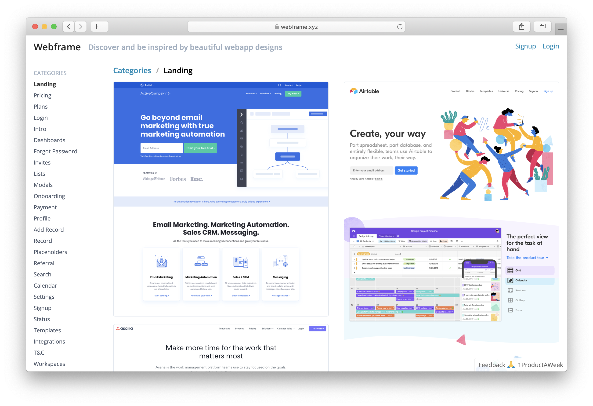

## Plan
#### Problem
Inspiration is a great way to kickstart a new design, but it can be time consuming to find well designed web apps, especially as you have to sign up to each one first (before you know if it’s any good)!

#### User
A designer or product hacker looking to create new designs for their app.

#### Marketing
* ProductHunt launch
* Design forums

#### Pricing / Revenue
* Sponsored placement - we could allow people to sponsor contributions (i.e. they sponsor their page and it goes to the top of the inspiration page for that category)
* Ads - boring but it might work if we generate enough traffic
* Additional features - pay for additional features 

#### Competition
* [One Page Love](https://onepagelove.com) - only offers one page websites
* [Pttrns](https://pttrns.com)  - only for mobile apps
* [Calltoidea](https://www.calltoidea.com) - a bit unfocussed and messy - we can do better than this

#### Risks / Assumptions
* Will this generate enough traffic to be worthwhile?
* Will people pay for ads or for additional features

#### MVP
* Easy and fast way for me to upload content
* A list of categories with screenshots - e.g. billing, signup, login, etc 
* A page with the screens for a web app
* Bonus points - enable users to upload screenshots

#### Basic Plan
Day 1 - create the initial design, setup basic framework/layout 
Day 2 - add lots of designs (possibly allow submit if extra time) 
Day 3 - add feedback/validatin features - newsletter, signup 
Day 4 - launch the product on PH and in forums 
Day 5 - schedule interviews with people using the site 

## Daily Log
### Day 1
☀️ 20° - Sunny intervals and a gentle breeze

Feeling good! Ok, let's get to it!

#### Summary

The morning was not terribly productive - we can do better here. It also took longer than expected to get to grips wth the react-static setup, but that's because it's been a while since I've used it and some things have changed.

### Day 2

☀️ 20° - Sunny and a gentle breeze

We're a little bit behind from yesterday. Let's get to it.

  - [x] Finish the navigation / homepage for the app
  - [x] Resize images so they load faster (currently each image is ~3MB)
  - [x] Add a download button to navigation view
  - [ ] Add a button to view all screens for an app
  - [ ] Adding a good number of examples

#### Summary

I did most of the tasks I wanted to do today, but I spent much longer on the resizing image / cache feature. I think the lesson here is *Stick to what you know*! I tried out a new tool ([fly.io](http://fly.io])), and got slowed down because I couldn't get the caching to work. I then tried a different approach (deploying an open source code base via Google Cloud Run) and got it working pretty quickly.

### Day 3

☀️ 20° - Sunny intervals and a gentle breeze

We're launching tomorrow - so today is the last dev day. Lot's to do!

  - [x] Add a button to view all screens for an app
  - [x] Deploy server to ~~[Netlify](https://netlify.com/)~~ [Firebase](https://firebase.google.com/)
  - [x] Improve category (/tag) - allow multiple tags to be selected
  - [x] Add a good number of examples (as this may change later scope)
  - [x] Add custom domain for webimages (so we can use CDN)
  - [ ] Consider adding views by industry
  - [ ] Add a fake subscribe to changes btn (to see if people want that)
  - [ ] Add a signup so people can save their favourite designs

#### Summary

Ah, I didn't launch today 🤦‍♂️. I was hoping to launch at the end of the day, but there were still some loose ends to tie up. In particular, I want to add a signup process and more screenshots. 

### Day 4 

☀️ 22° - Sunny intervals and light winds

This is some incredible weather we're having! Focus today is on adding signup/feedback, more screenshots and start reaching out to prospective users. Oh and also launch, possibly tonight - still trying to figure this all out!

  - [x] Add a signup so people can save their favourite designs
  - [x] Resize image crashing fix (because server runs out of memory)
  - [x] Fix [Cloudflare CDN](https://www.cloudflare.com/) not caching images
  - [x] Add lazy loading, otherwise page takes a long time to load!
  - [x] Add SHA to images (and use that as the image ID)
  - [ ] Add popup to encourage signup
  - [x] Add ProductHunt banner
  - [x] Add 5 more products to screenshot
  - [x] Populate week categories (and check for new categories)
  - [ ] All image requests go through cdn.webframe.xyz??
  - [ ] Add social buttons
  - [ ] Add feedback tool
  - [ ] Add mobile friendly nav
  - [ ] Add analytics - [GA](https://analytics.google.com/analytics/web/) / [Mixpanel](https://mixpanel.com/)

#### Summary

A productive day, but still not not everything is finished 😭. I think this is fear of launching creeping in again! I didn't end up doing any *promotion* - I'm still unsure whether it's best to focus all attention on launch day or build up a bit of audience beforehand. I guess it's something I will need to try out.

### Day 5

☀️ 22° - Sunny intervals and a gentle breeze

Sunny weather makes me happy 😍! Today is focussed on getting in a launch READY state. That means I need to be ready to click that ProductHunt button. In fact, I think I will schedule it to launch automatically. New launch date is now ~~**Tuesday 28th May @ 9.30am BST**~~ **Wednesday 28th May @ 8.00am BST**.

  - [x] Add popup to encourage signup
  - [x] Add analytics - [GA](https://analytics.google.com/analytics/web/)
  - [x] Add feedback tool
  - [x] Generate ProductHunt launch materials
  - [ ] Add social buttons
  - [ ] Add submit product btn??
  - [x] Make top rated products go first
  - [x] Show loading while getting initial results
  - [ ] Add mobile friendly nav
  - [ ] Add product/tags overlay to screens in list view
  - [ ] Improve SEO by generating a page for each screen

### Launch

☁️ 18° - Light cloud and moderate breeze

Not so sunny today, hopefully not an reflective for the launch!

  - [x] Test webframe.xyz website
  - [x] Share with friends!
  - [x] Post articles on Medium
  - [x] Send e-mail to Saasified mailing list (a previous project)
  - [x] Send @tweets to accounts that were used to build webframe.xyz (@tailwind, @fly.io, @reactstatic, @gatsby, @firebase, @mailgun) - retweet posts on @saasified and @calummoore
  - [x] Publish dev blog on React Hooks
  - [x] Message design communities - Slack, Discord, DesignerNews
  - [x] Respond to some more Quora questions
  - [ ] Add video of building the product somewhere!?
  
So the launch went better than expected! I got #1 for the day and week 😍. Thank you to everyone who upvoted. You can checkout the full review of for this product here - [Webframe Launch Review](/webframe-launch-review)