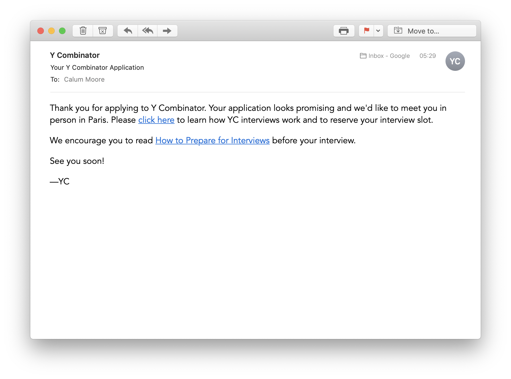

I've applied to [YC](https://ycombinator.com) 3 times before, and this is the first time I've been invited for interview. Below you can see the interview invite email (isn't it beautiful). Yes, this is only the first step in getting accepted, but it does feel like a new milestone! My interview is on 7th Nov 2019 - so lots to pack in before then!

## Plan

The key goals for this week are to:

  - [x] Talk to 3 users (and build specific boards for them)
  - [ ] Create 40 new cards / integrations
  - [ ] Start testing 3 [“Traction”](https://www.amazon.co.uk/Traction-Startup-Achieve-Explosive-Customer/dp/0241242533) growth channels
  - [ ] Setup public Snapboard metrics page - so I can better track changes
  - [x] Update blog
  - [x] [Hire someone](https://discuss.snapboard.io/t/were-hiring/16) to help! 

## Daily Log

### Day 1
Thursday, 17 October 2019: 🌦 14° - Light rain showers and a gentle breeze

Today I got the invite for YC, so I've been planning how to make a splash. Obviously feeling pretty motivated - so going to see if I can use that to be extra productive today.

  - [x] Created the plan
  - [x] Create a discussion forum for Snapboard
  - [x] Re-start the blog under Snap/Blog (the one you're reading right now!)
  - [x] Updates to the integration page for Snapboard
  - [ ] Updates to the homepage for Snapboard

Not a bad day - got most of the stuff I wanted to do done, and although the website still needs updating (it hasn't changed since first launch 😅), it's less of a priority so it's going to get parked for now.

### Day 2
Friday, 18 October 2019: 🌦 14° - Light rain showers and a moderate breeze

  - [x] Speak to 1 user
  - [x] Decide on my first 3 traction channels / what type of users to target
  - [x] Fix formula (sometimes it was crashing)
  - [x] Add Snapboard to Saasified Homepage
  - [ ] Add Snapboard to Webframe.xyz
  - [ ] Add 5 new cards / integrations
  - [ ] Public Snapboard metrics page
  - [ ] Start Facebook approval (really complex review process 🙄)
  - [ ] Updates to the homepage for Snapboard
  - [ ] Improve capturing of analytics events - so I can better understand user actions

Maybe I was a bit too ambitious! Either way, I need to prioritize creating cards. This is one of the best ways I can create new value for people, and prove to YC that I can move quickly. If I can get 6 done per day over the next 17 days - that's 102 cards when I meet YC.

Really pleased we've started to understand who we will target though - this will be really helpful for all future decisions.

#### Which users should I target?

I've seen all of the following groups on Snapboard so far, but I need to have more focus to make the product better for a specific group, and then I can scale to others later.

  1. Marketing guy/gal - uses quite a few different apps: Adwords, Social, Google Analytics, etc. Possibly not as tech savvy, will rely more on the pre-made cards being what they need. Could drive more support requests too.

  2. Start-up founders (early stage) - this is an active group, and one likely to give me a lot of feedback and invest in the product. They probably have more apps as they're managing/covering a bigger area (e.g. start up founders do a bit of everything). I'm also part of this group (and already know quite a few others in this group), which makes it attractive. Possibly less likely to pay? 

  3. Teams - this is probably too broad a group to be considered an option right now, but definitely something we will want to cater specifically for in the future - when we understand more about the different types of teams using it.

  4. Agencies - the decision maker (who runs the agency) might not be as tech savvy, but possibly someone who works for them might be. High conviction to pay if we get them something they want - as they'll often share boards with their clients. They might be better served by existing dashboards than other groups though?

  5. E-commerce - often work through an agency for this type of reporting (although not exclusively), so overlap with the above. Main focus would be on Shopify and other e-commerce platforms, but also has fairly strong links to marketing (as they're keen to understand attribution of sales).

The key things to evaluate when picking the group to target is:

  1. How easily can I access this market - do I already know people/communities?
  2. How likely are they to pay?
  3. How invested would they be in the product? Would they become ambassadors?
  4. How technical the group is - would they be able to validate the more advanced features (e.g. formula)?

Based on this, the main group I've decided to target is: **Start-up founders (early stage)**. 

The biggest draw back here, is their likelihood to pay. That said, if we can make it work for start-up founders, then I think we will be able to transition into teams and businesses. Also, if we can make these guys pay - that's a very good sign!

#### What marketing channels should I use?

Based on the above - I've decided the 3 traction channels I'm going to try first are. They will get a 2 week period starting on *Monday 21 October* to determine which to focus on:

  1. Integrate with Existing Platforms - this is a bit of a no brainer as Snapboard is almost entirely built on integrations! I need to think about what platforms my target group will be on. 🤔

  2. Direct Mail - contact people directly who I think might be interested in having a board. ProductHunt, Startup School, etc. Don't want this to be spammy, so need to think carefully how to implament this.

  3. Community - where do start-up founders hang-out? Start-up school, IndieHackers, Slack communities, Quora?

I'll be measuring these on hits to the website and conversion to signup. **TODO:** need to make sure there is a way for me to measure this.

#### What kinds of cards would Start-up founders be most interested in?

  1. Server metrics - a simple look at how your website is performing - could also involve DBs (how many records in a queue, uptime stats, total number of errors)
  2. Website/user analytics - Google Analytics, Mixpanel, Amplitude, Segment
  3. Conversions and financial metrics - Stripe for MRR, Paypal, Podio
  4. Costs and spend - in particular server costs, but any other variables too
  5. List of customers, e-mail address and possibly status (paying / non-paying) - most likely from a DB
  6. Support requests - some metrics on how many tickets - would be much more interesting if we could do this by category! E.g. 20% of support requests are for password reset.

#### Feedback from User 1

Founder - SaaS / Video

1. Interested in usage metrics - 
    * New visitors to the site - Google Analytics
    * Users who render a video - Mixpanel
    * New paid users - Stripe
2. Number of failures - Google Cloud / DB
3. Being able to restart servers - Google Cloud / DB
4. Resetting passwords (as currently have to go into DB) - DB
5. Check if user is on paid plan - DB / Stripe

They use the following apps:

 * Google Cloud
 * Postgres
 * Mailgun
 * Mailchimp
 * Mixpanel
 * Netlify
 * Heroku
 * Bitbucket
 * Sentry

### Day 3

Saturday, 19 October 2019: 🌥 15° - Sunny intervals and a moderate breeze

It's a Saturday, but the girlfriend is away at a festival, so that means I'll be working today. 🤓

You'll notice, I've also added a tag to each action item below. I want to make sure that I make progress with each of the following every day:

 - #cards - adding new integrations and cards
 - #marketing - getting people to visit to [snapboard.io](https://snapboard.io)
 - #optimize - small changes which increase conversion - getting more people to signup and create cards
 - #talk - keep talking to users (which should help shape the above items)

So here are my goals/tasks for today:

 - [-] Create 6 integrations #cards
 - [x] Added webhook logic (required for Github integration) #cards
 - [x] Add Snaboard to Webframe #marketing
 - [ ] Start Facebook approval #cards
 - [ ] Add formula dropdown #feature
 - [ ] Updates to the homepage for Snapboard #optimize

Still not enough progress on creating cards. Need to keep working at making this faster!

#### New Cards

 - [x] YouTube - Video Stats
 - [x] Firebase - new users over time
 - [x] **Github** - Issues
 - [x] **Github** - Repos
 - [ ] **Trello** - Cards assigned to me
 - [ ] **Wufoo** - number of response to form
 - [ ] **Wufoo** - chart with question response totals

**Bold** for new integrations

#### A better way to handle imported data?

Having worked with the YouTube data import today, it seems like we may need a better way to work with the data we import. The problem is, some APIs produce a fairly complex multi-depth response (YouTube is a case in point). It returns multiple types of ID, sometimes it's a string, sometimes it's an object! Even the title of a video is not at the root level (you have to use `snippet.title` 🤯)?! If all this sounds confusing, it is! 😅 YouTube's API is a mess (and I'm sure it's not the only one), and I don't want to pass this mess and complexity onto users. So I'm considering tampering/normalizing the data to make it easier to understand and use. 

The other benefit of normalizing the data in some way, is that if I can find a way to normalize similar types of data across apps, it means that the same card will work across apps too - so the user can seamlessly switch. Imagine a chat card that you can seamlessly switch between Intercom, Slack or Drift?

The problem with editing/normalizing though is as follows:

  * It can be hard to maintain as changes to a 3rd party API would need to manually updated in Snapboard
  * There's not always an obvious way to link data
  * It needs to be easily
  * Some data makes sense to be multi-depth - e.g. details of an image

🤔 Need to think about this some more.

### Day 4

Monday, 21 October 2019: ☁️ 13° - Thick cloud and a gentle breeze

Today's focus is on getting the message out that we're hiring. I really need some help to make sure we've made good progress for YC.

 - [x] Add beta mode, so we can give access to 3rd parties to test their integration, without confusing everyone else!
 - [x] Marketing for hiring (see below)
 - [x] Talk to another user
 - [ ] Start Facebook approval #cards
 - [ ] Add 6 more cards
 - [ ] Add formula dropdown #feature

Wow, this was a crazy day. I had all this stuff planned for how to get some help on Snapboard - and it turns out all I needed to do was post on Reactiflux - I was inundated with requests. So, I'll be working with that I've got for now. Fustratingly it took most of the day, so didn't get any more cards added 😢. It really needs to be my top priority! 

#### Marketing for Hiring

Here's a quick summary of my plan of action for hiring. I created a new blog post yesterday evening, which I will use as part of the promotion for the job role. It helps to have something related and interesting to offer communities you are posting to.

  - [x] Publish blog article
  - [x] Slack communities - in particular dev related ones!
  - [x] Reactiflux - post my blog article, and to their jobs channel
  - [ ] IndieHackers
  - [ ] HackerNews - post my blog article to HackerNews
  - [ ] Reddit
  - [ ] E-mail subscribers to my blog
  - [ ] E-mail people who created custom cards on Snapboard
  - [ ] Fiver / Upwork - post a job, need to think of the right thing to ask for!
  - [ ] Medium - look for writers with around 100 upvotes on a tech related article (it means their not a household name so might be interested in this oppertunity!)

#### Feedback from user

Founder: Single technical founder, Productivity SaaS

Here are the key points:

 * Doesn't trust the numbers coming from Mixpanel - so uses his DB as a way to track numbers
 
 * Might not give Snapboard direct access to DB, but would be happy to expose an endpoint (would prefer that to push data via an API)

 * Would love to see cards detailing lead to conversion metrics (including trial) - that might involve GA -> Mixpanel -> Stripe

 * Would be willing to give access to data, as long as it proved useful

 * Doesn't go into the DB for metrics

Uses the following apps:
 
 * Stripe
 * Google Analytics
 * Fullstory / Log Rocket
 * MySQL - for DB accessed via SSH
 * Digital Ocean
 * Mixpanel - plans to use this in future

### Day 5

Tuesday, 22 October 2019

Hired the first dev for Snapboard. Welcome to the team Dan! Interviewed and hired on the same day 🙌.

Most of this day was spent onboarding Dan, and helping him understand the code base. There were also a few changes needed to get the environment up and running on his machine - as this is the first time I've had someone else working on it! Dan will be mainly focussed on adding integrations - because that's one of the biggest drivers for growth and retention.

### Day 6

Wednesday, 23 October 2019

Hired the second part-time dev for Snapboard. Welcome to the team Julio! He'll be working most on the front-end.

To be honest, I've completely forgotten what else I did on this day 😂. I'm writing this 2 days later on Friday, and I've already forgotten. Need to make sure I find time to update this on the actual day - as that means the updates are better!

## Review

Wow, that week went FAST. 15 days to go until the YC interview. 😬

Overall, not a bad week - 3 out of 6 items complete. Obviously onboarding took up a fair chunck of time, but that's already started to pay dividends, and we should see that only increase over the next week. Everyone on the team is aware of the Nov 7th deadline and working really hard to maximise their progress in this short period.

Next week's focus will be on ramping up the speed to add new cards, improving the user experience around card customization and improving the general user experience. Oh and I'm going to get started on the marketing side of things!

Of all of those things - adding cards and integrations is the most important.

Follow along next week, I'll be updating it daily!

