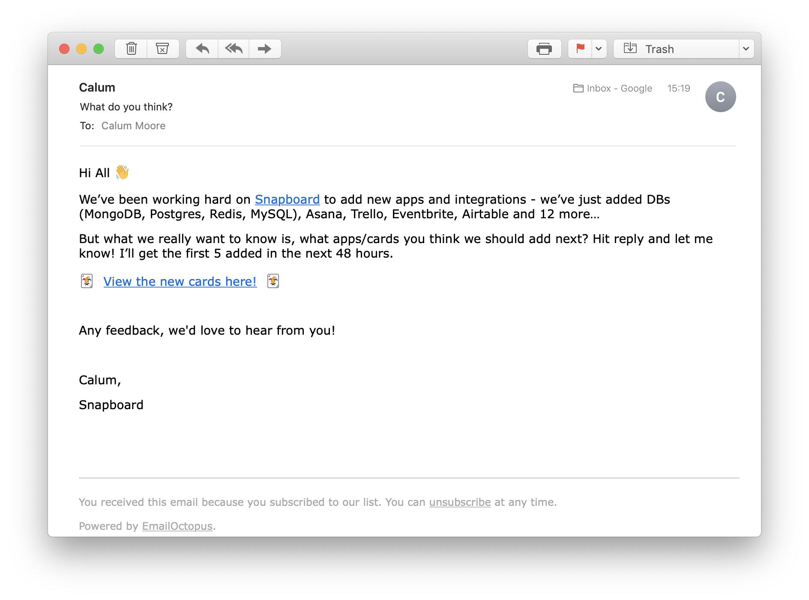

Last week went well, but the major focus has to be on creating more cards, more quickly. In addition, these remain my top priorities:

 1. Cards - adding new integrations and cards
 2. Marketing - getting people to visit to [snapboard.io](https://snapboard.io)
 3. Optimize - small changes which increase conversion - getting more people to signup and create cards
 4. Retention - getting people to come back and use the product after their first time
 5. Talk - keep talking to users (which should help shape the above items)

## Plan

Based on the above - I want to acheive the following this week:

  - [x] Talk to 3 more users
  - [x] Improve "edit card" page
  - [ ] Create 40 new cards / integrations
  - [ ] Start testing 3 [“Traction”](https://www.amazon.co.uk/Traction-Startup-Achieve-Explosive-Customer/dp/0241242533) growth channels
  - [ ] Setup public Snapboard metrics page - so I can better track changes

## Daily Log

### Day 1

Thursday, 24 October 2019: 🌧 12° - Rain, Rain, Rain

Ok, so today I need to:

 - [x] Create backlog for Front-end for Julio to work on
 - [ ] Create new card inputs apprach (make editing cards much nicer!)

Ah man, didn't feel like a very productive day 😅 - I spent a bit of time thinking about how to make the cards easier to edit - and that kind of thing never feels productive, but is obviously a neccessary step before creating loads of new cards.

Starting to feel very nervous about the [YC interview](/week-001) date. It's now exactly two weeks away. In fact, I was feeling so stressed - I had to go grab a beer at 3pm to calm myself and focus with the days work. It actually really helped 😅.

### Day 2

Friday, 25 October 2019: ☁️ 14° - Thick cloud and a fresh breeze
 
Julio did an incredible job getting the first version of the formula autocomplete feature working - check the video below!

<iframe src="https://www.loom.com/embed/8ccbaec3489d4c77920a7a89b99f5af7" frameborder="0" webkitallowfullscreen mozallowfullscreen allowfullscreen style="position: absolute; top: 0; left: 0; width: 100%; height: 100%;"></iframe>

Need to start work on marketing today, and find a way to try and get more people talking to me. PLEASE SOMEBODY TALK TO ME! 😂

  - [x] Talk to a potential user (e.g. start-up founder) - Megamaker Slack Group?
  - [x] Sent blog e-mail out
  - [x] Fixed a bunch of UX issues
  - [ ] Create new card inputs apprach (make editing cards much nicer!) 
  - [ ] Start one new marketing channel

Not a bad day, but still haven't been able to get around to the "Create new card inputs" task. I need to do this at the start of the day, because it takes significant energy to do - so if I'm tired it ends up not happening. It will be the first thing I look at tomorrow!

	
<h4>Talk with Potential User</h4>

	Founder - SaaS - Developer Tools / Productivity

	Has built his own internal dashboard to see the metrics that really matter to him. Doesn't use other tools, because existing dashboards don't show him what he needs - or would take too long to configure! His current (internally built dashboard), pulls everything from his DB. He's not sure if he would give access to the DB or not. There's basically only 3 options getting DB data - push (like Mixpanel `track`), pull from an exposed API that gets data from the DB or direct DB access. Seems like the best option might be some kind of push - and then we can create a library for each language.

	Metrics that matter are Signups, Installs, Active Customers. He also tracks engagement on a per user level - so he sees if users have done key activity like - how far are they through their trial, how many participants, how many reports they've generated.

	Recommended that I start a Typeform to ask people what integrations they want, sounds like a good idea. Unsure whether to send it to the entire list on Snapboard though, because I don't want to send too many e-mails and I want to update them once we have more apps in play - oh wait - that's catch 22 😂. I probably need to e-mail them next week anyway, to allow people time to engage before the interview so I'll attach it to that.

	They use the following apps:

	* Beamer
	* Helpscout
	* Sentry
	* Stripe
	* Mixpanel - no longer uses as much
	* Mailerlite
	* Postmark
	* AWS / EC2 and RDS
	* Datadog
	* Logrocket

### Day 3

Saturday, 26 October 2019: 🌧 17° - Heavy rain and a moderate breeze

This isn't going to be a full working day, but I've got a good chunk of time - so I'm including an update. I really want to get the new card inputs done - because right now, it's blocking us creating new cards. And cards means ~~prizes~~ better engagement!

 - [ ] Create new card inputs apprach (make editing cards much nicer!)
 - [ ] Create a better admin page for creating template cards
 - [ ] Add Slack integration
 - [ ] Add Airtable integration

	
<h4>What to do about importer cards?</h4>

People aren't using the "importer" cards (cards which import raw data) because they're not shown in the main *+ Add card* modal. But if I add them there, it will be super confusing because when they select an "importer" card, it will not be added to their current active board but to the import boards section.

The import boards section was added, because when adding pre-configured cards, we often need to import additional data - e.g. for the 'Stripe Customer Count' card (we need to import a list of Stripe customers). We add this imported data to the imports section, to allow the user to see their raw data, how it's structured and potentially use it when writing their own formula.

For some apps (e.g. database apps, Airtable), there's no easy way for us to create pre-configured cards - because the data from databases is so varied. So the user will probably want to import the raw data first, and then manually use it in a chart/number card.

We could remove the importers secton, and add "importer" cards to the current active board - BUT that makes it harder to find and organize. And when a user creates a pre-configured card for a board, we'd end up adding 2 cards to their board - the pre-populated card and the importer card (again confusing). 

##### Things to think about

* Should we have an importers section at all? How would the user select data without them? 

	* We could have a kind-of hidden section on every board, which automatically shows dependencies for that board (obviously only shown to CREATOR roles). Having it on the same board would also mean the user doesn't have to move around as much. This would solve the "adding 2 cards to their board", because one would be semi-hidden. We would only need to hide it if we added it as part of a "pre-configured" card - and the user could hide any other cards they want too - e.g. they might want to have an data grid card, log card, etc - that's visible to admins only. In this case, if the user directly adds an importer card - then it shows on the main board - and they can then choose to highlight it later?

	* We could use a formula function to get data - but that makes it harder for a user because they would have to deal with IDs - which most users won't understand or know how to find.

* Is it really impossible to create pre-configured cards for database-type apps?

### Day 4

Monday, 28 October 2019: 10 days to go!

I HAVE TO DO "Create new card inputs apprach (make editing cards much nicer!)" TODAY. If I do nothing else - that's okay. I need to get that done. I can't create new cards without it - and we need more cards!

  - [x] Create new card inputs apprach (make editing cards much nicer!)

End of the day update: Ok, so this is almost finished - there are a few loose ends to tie up (as always) but I should be able to get this finished tomorrow morning.

	
<h4>Talk with Potential User</h4>

Founder - SaaS - Marketing Site Builder

Great chat! He's also using ProductHunt launches as a growth strategy - and getting even better results than me 🙂! I think it's because his secondary product was much more closely related to his primary product. I'll need to consider that next time.

Interested in tracking these metrics: 

 * Total visitors to the site
 * Number of people demo-ing
 * Number of people that convert to paid subscriptions (stored in DB)

Has metrics in his DB also.

They use the following apps:

 * Google Analtyics
 * Stripe
 * React, Python, Golang, Nginx
 * AWS - S3, EC2, 
 * Sheet2Site (for storing subscribe emails in Google Sheets)
 * Crisp (for chat)
 * Sentry
 * Discord
 * Postman
 * Google Sheets

Want to start using Mixpanel/Amplitude but not doing so yet.

### Day 5

Tuesday, 29 October 2019: 9 days to go!

 - [x] Finish off changes for chart card
 - [x] UX improvements
 - [x] Talk to a potential user
 - [x] Deploy updates
 - [ ] Create a better admin page for creating populated cards fast!
 - [ ] Create a better "list" card

I finished the chart card input and it's working really well - super psyched about that as it's a real step change in the way people add chart cards. Obviously will still need futher tweaks - but it's so much easier to use now.

<iframe src="https://www.loom.com/embed/edee1b10dfe64f02aa88b6a49a95d34d" frameborder="0" webkitallowfullscreen mozallowfullscreen allowfullscreen style="position: absolute; top: 0; left: 0; width: 100%; height: 100%;"></iframe>

	
<h4>Talk with user!</h4>

		
Founder - Consultancy

Works with start-ups and businesses to help them grow. Use partnerships to grow. Dashboards that demonstrate worthiness to clients is useful.

Key apps:

 * Stripe
 * Streak
 * Google Search Console
 * Kajabi

### Day 6

Wednesday, 30 October 2019: 8 days to go!

 - [x] Finish off changes for chart card
 - [ ] UX improvements
 - [x] Talk to a potential user
 - [ ] Deploy updates
 - [ ] Create a better admin page for creating populated cards fast!
 - [ ] Create a better "list" card

Also spoke to a YC alumni today, who gave me a mock interview and was super helpful! Key takeaways:

 * Shorter answers (I like to talk a lot 😅)
 * Focus on customer over tech
 * Have a key insight that you want to share

### Day 7

Thursday, 31 October 2019: 7 days to go!

 - [x] Deploy latest integrations
 - [ ] Create a better "list" card
 - [x] Create more cards!
 - [ ] UX improvements
 - [ ] Setup public Snapboard metrics page - so I can better track changes

Met with the guys from [GFC](https://www.globalfounderscapital.com) today, they were super useful - again loads of great feedback! Here's a few highlights:

  * Shorter answers (again 😂)
  * Add metrics to every answer - particuarly for retention!
  * Market size question needs more work - broad-range of customers - E-Commerce, Agencies, Start-ups. Bottom up $10, average team x5 = $50. 10% of start-ups with seed funding. Look at growth of similar YC companies in this space. 40% of Slack is Enterprise.
  * More focus on how we are prioritizing customer feedback
  * Remember to always be custoemr-centric!

I'm planning to send out a big update to ALL existing subscribers on Monday - so we need some good updates for them. That's where our focus will be over the next few days!

### Day 8

Friday, 01 November 2019: 7 days to go!

What?! How does a week have 8 days in it 😂. Ok, it doesn't - but we have a BIG launch scheduled for Monday, so I thought it makes more sense to include the next couple of days here.

 - [x] Add error messages to cards
 - [x] Add info box to importers (if there is something we need to make user aware of)
 - [x] Merged in formula auto-complete (great work from Julio!)
 - [ ] Create more cards!

### Day 9

Saturday, 02 November 2019: 6 days to go!

So today I've been focussing again on creating more cards again. I always find a way to avoid doing that which is really bad.

 - [x] Created 6 new cards (+ finally finished Firebase importer)
 - [x] Use icons for the import section (and rename to "Apps")
 - [x] Improve chart card inputs to accept a string field name OR a formula

A good amount of progress, but STILL didn't create as many cards as I needed to. Dan is creating loads of importers (which import data into Snapboard), which is awesome (thanks Dan 😍) - but they're useless unless we create cards for them - and that's my bad 😅!

	
<h4>More thoughts on Importer Cards</h4>

I really can't let this topic go! If you've been following along, you'll know that I've been thinking about what to do with the Imports section and "Importer" cards. At the moment, Snapboard is split into two sections - general purpose boards where you add your chart, list, number cards - and Import boards, where we show you the data we've imported in an Excel like grid.

Actually, the most important requirement is to simply allow Import cards to appear in the *+Add card* window - so what's the quickest and easiest way to do this? We can work out a better solution later - for now we just need to make them appear (for our Monday launch)!

Current ideas:
 
 * 👍🏽 Allow the grid card to take a formula, so we actually add a Grid card (that references the Import card)

 * Add importers directly, and navigate user to the Imports page when they add it

### Day 10

Sunday, 03 November 2019: 5 days to go!

RE-LAUNCH DAY tomorrow. Pretty excited - but loads to do! Also, I have another mock-interview later today, so I'll update on how that goes!

The most important thing is to get the integrations published and the import cards added to the card menu.

 - [ ] Publish the 20 new integrations (we've been working on these all week), but we need to make sure all have cards ready and visible in the directory!
 - [x] Update list view card
 - [ ] Add import cards to the *+Add card* modal
 - [ ] Add "Make card from card" - e.g. the user can create a chart card from a grid card
 - [x] Mock interview
 - [ ] UX Improvements

### Day 11

Monday, 04 November 2019: 4 days to go!

STILL NOT RE-LAUNCHED - Argh, not this again. This is so fustrating. I need to just send out this darn mail. 

OK this HAS to be the last day. I'm sending it out tomorrow - no matter what happens. If you don't have an e-mail in your inbox tomorrow then... feel free to send me some abuse!

This is the only task for today - get ready for launch.

 - [x] Publish cards ready for launch

Update: OK - that seems to have done the trick. I'm now ready for launch!! 😅

### RE-LAUNCH

This wasn't suppose to be so difficult. Sending an e-mail to existing subscribers with some updates, should be a really simple non-issue. But I find myself really not wanting to send out this e-mail. So many thoughts go through your head... what if this is the only chance to get people back using Snapboard? What if everyone unsubscribes because the updates aren't good enough? Shouldn't I hold off just one more week to make sure the update is better?

I think we all go through this as product builders - but it's that kind of attitude that led me to not launch products in the past. So I'm going to push through the pain, push the button and hold on tight.

Update: Well I did it. Here's the e-mail, see I did send it - I'll let you know the results in next weeks update :) Plus next week is YC week, so stay tuned for whether I get in or not.

