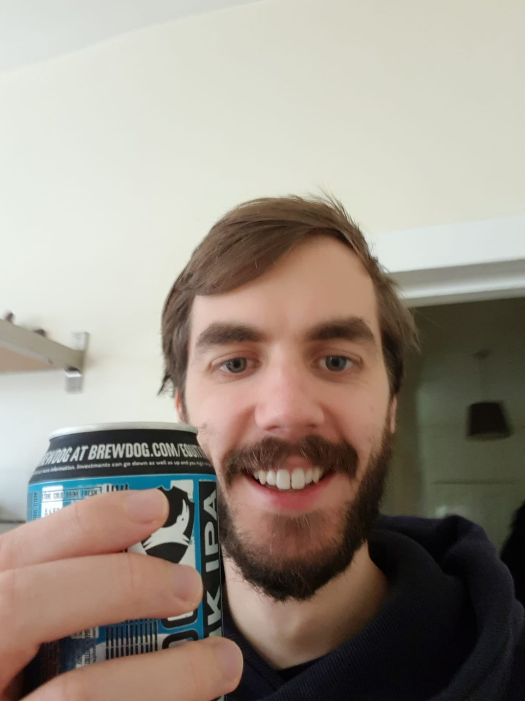

Last week went well, but the major focus has to be on creating more cards, more quickly. In addition, these remain my top priorities:

 1. Cards - adding new integrations and cards
 2. Marketing - getting people to visit to [snapboard.io](https://snapboard.io)
 3. Optimize - small changes which increase conversion - getting more people to signup and create cards
 4. Talk - keep talking to users (which should help shape the above items)

## Plan

Based on the above - I want to acheive the following this week:

  - [ ] Talk to 3 more users
  - [ ] Improve "edit card" page
  - [ ] Create 40 new cards / integrations
  - [ ] Start testing 3 [“Traction”](https://www.amazon.co.uk/Traction-Startup-Achieve-Explosive-Customer/dp/0241242533) growth channels
  - [ ] Setup public Snapboard metrics page - so I can better track changes

## Daily Log

### Day 1

Thursday, 24 October 2019: 🌧 12° - Rain, Rain, Rain

Ok, so today I need to:

 - [x] Create backlog for Front-end for Julio to work on
 - [ ] Create new card inputs apprach (make editing cards much nicer!)

Ah man, didn't feel like a very productive day 😅 - I spent a bit of time thinking about how to make the cards easier to edit - and that kind of thing never feels productive, but is obviously a neccessary step before 

Starting to feel very nervous about the [YC interview](/week-001) date. It's now exactly two weeks away. In fact, I was feeling so stressed - I had to go grab a beer at 3pm to calm myself and focus with the days work. It actually really helped 😅.

### Day 2

Friday, 25 October 2019: ☁️ 14° - Thick cloud and a fresh breeze
 
Julio did an incredible job getting the first version of the formula autocomplete feature working - check the video below!

<iframe src="https://www.loom.com/embed/8ccbaec3489d4c77920a7a89b99f5af7" frameborder="0" webkitallowfullscreen mozallowfullscreen allowfullscreen style="position: absolute; top: 0; left: 0; width: 100%; height: 100%;"></iframe>

Need to start work on marketing today, and find a way to try more people talking to me.

  - [ ] Talk to a user - Megamaker Slack Group?
  - [ ] Start one new marketing channel
  - [ ] Create new card inputs apprach (make editing cards much nicer!) 

*To be continued...*

## Review

*Will update at the end of the week 👍🏽*

